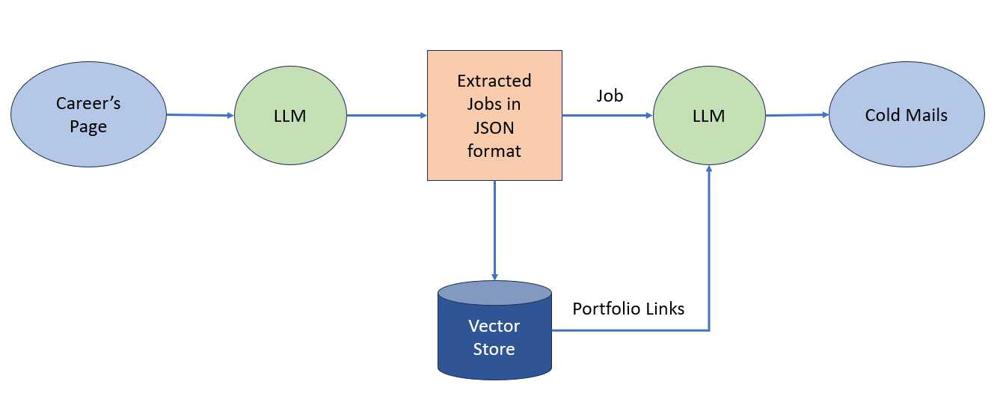
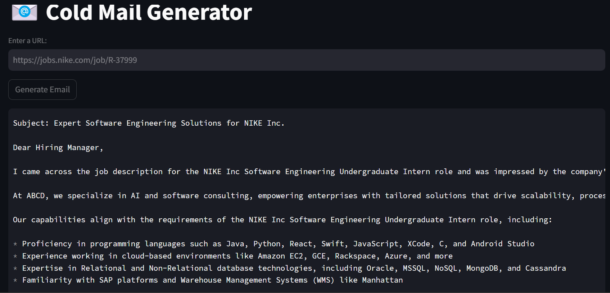

# Cold Mail Generator

A **Cold Email Generator** tool for service companies that automatically extracts job listings from a company's careers page and generates personalized cold emails. These emails include relevant portfolio links based on the job descriptions, helping business development teams efficiently target potential clients.

## Features

- **Job Listing Extraction**: Extracts job listings from the provided URL of a company's careers page.
- **Personalized Cold Emails**: Generates cold emails tailored to the job descriptions, including portfolio links.
- **Vector Database Integration**: Uses a vector database to pull portfolio links based on job descriptions.
- **Streamlit Interface**: Simple and user-friendly interface built with Streamlit for easy interaction.

## Technology Stack

- **Python**
- **Groq API** for job listing extraction
- **Langchain** for natural language processing
- **Streamlit** for the web app interface
- **Vector Database** for portfolio matching

## Architecture

The project architecture includes:
- Web scraping for job listings
- Language model-based email generation (Langchain)
- Integration with Groq API for dynamic content extraction
- Portfolio linking using vector databases



## Installation and Setup

### Prerequisites

- Python 3.x
- Groq API key (Get it from [Groq Console](https://console.groq.com/keys))

### Steps to Set Up the Project

1. Clone this repository:
   ```bash
   git clone https://github.com/YourUsername/Cold-Mail-Generator.git
   cd Cold-Mail-Generator
   
2. Install dependencies::
   ```bash
   pip install -r requirements.txt

3. Set up your Groq API key:
   - Get your API key from [here](https://console.groq.com/keys).
   - Inside app/.env, update the value of GROQ_API_KEY
   
   ```bash
   GROQ_API_KEY=your_api_key_here
   
4. Run the Streamlit app:
   ```bash
   streamlit run app/main.py

### Running the Application

Once the setup is complete, open the app in your browser (usually at `http://localhost:8501`), enter the URL of a company's careers page, and generate personalized cold emails for business outreach.

## How It Works

1. **Input the URL** of a company’s careers page.
2. The tool **extracts job listings** using the Groq API.
3. **Langchain** processes the job descriptions and generates cold emails.
4. The tool **adds relevant portfolio links** from a vector database based on the job descriptions.
5. **Cold email** is generated and ready to be sent to potential clients.

## Example Scenario

Imagine that Nike is hiring a Principal Software Engineer. Your company, ABCD, provides dedicated software engineers. You can use this tool to send a personalized email to Nike, pitching your services, while linking relevant portfolio examples.

